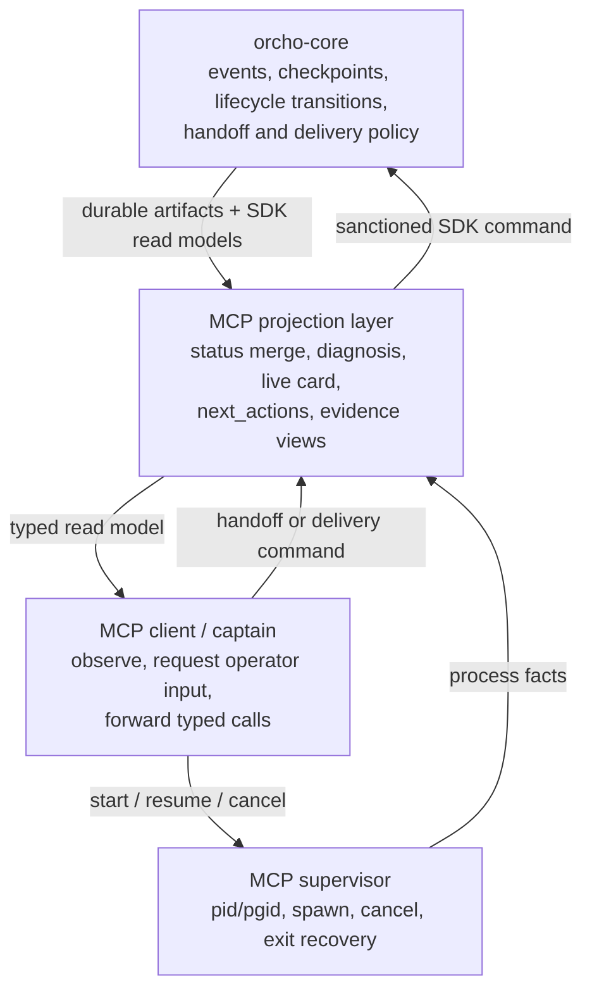
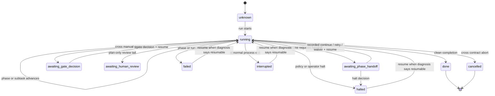
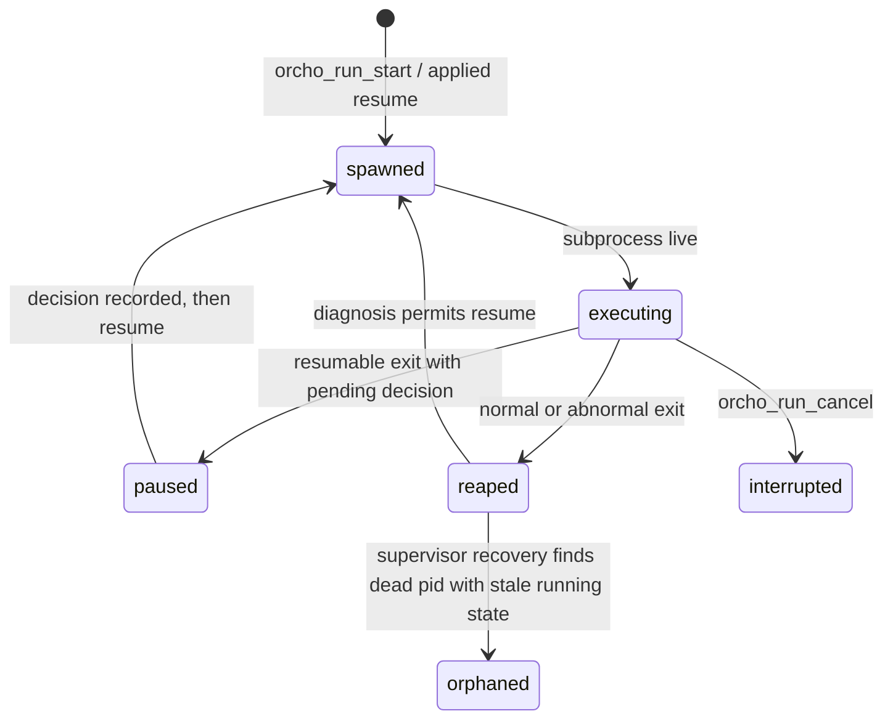
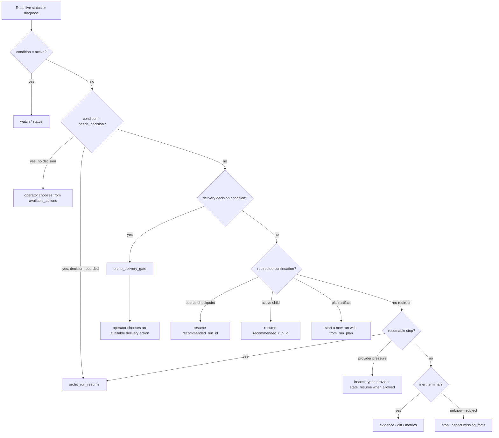
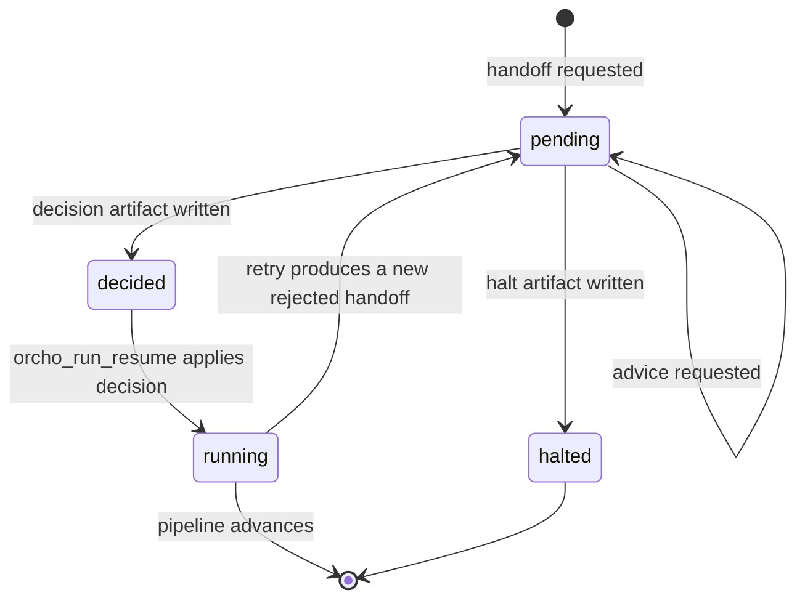
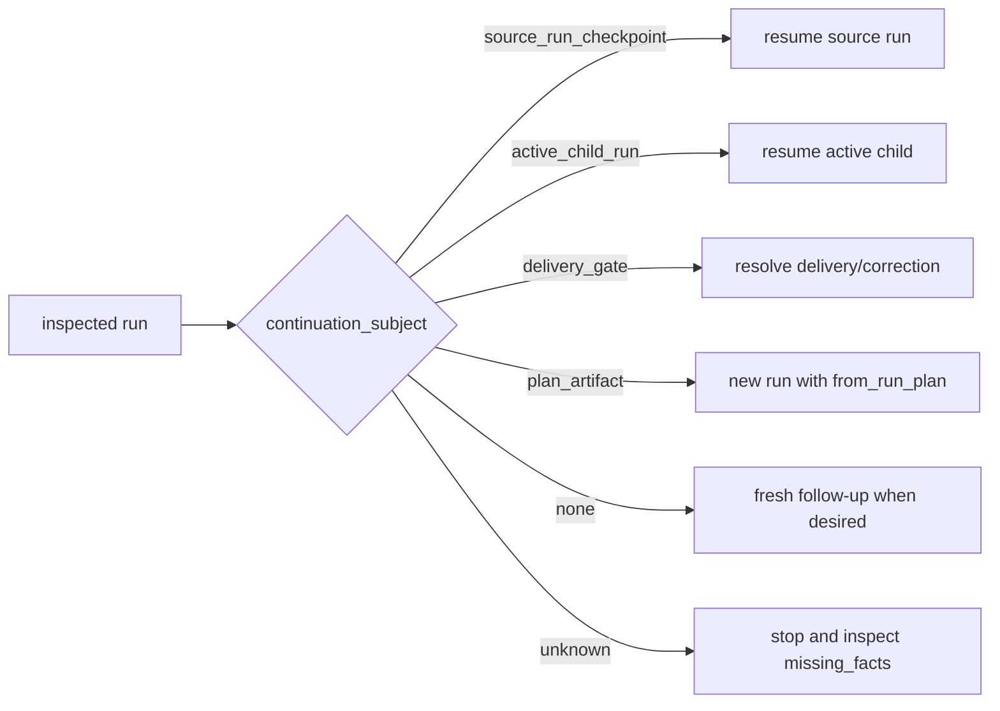

# MCP Control State Machine

This document is the canonical map of how an MCP client observes and controls
an Orcho run.

The lifecycle authority remains
[orcho-core's run state machine](https://github.com/symphos-ai/orcho-core/blob/main/docs/architecture/run_state_machine.md).
`orcho-mcp` does not define a second lifecycle. It projects core state into
bounded typed read models, adds supervisor process facts, and exposes the
sanctioned commands that can advance the run.

Use this reference when implementing a captain, reviewing whether a proposed
MCP action is safe, or adding a new state or decision surface.

## The state is multi-axis

A run cannot be described correctly by one enum. The durable lifecycle status
is only one axis; process state, pending decisions, lineage, delivery, and
control authority vary independently.

| Axis | Authority | Representative values | Primary MCP surface |
|---|---|---|---|
| Durable lifecycle | core `events.jsonl` + `meta.json` | `running`, `awaiting_phase_handoff`, `awaiting_gate_decision`, `awaiting_human_review`, `done`, `halted`, `failed`, `cancelled`, `interrupted` | `orcho_run_status` |
| Execution coordinate | core event stream | current phase, current subtask, last activity, event sequence | `orcho_run_live_status`, `orcho_run_events_summary` |
| Supervisor process | `mcp_supervisor.json` | running, paused handoff, done, failed, interrupted, `orphaned` | merged into MCP status reads |
| Pending execution action | core run snapshot | phase handoff, cross gate, none | status and diagnosis projections |
| Decision disposition | decision artifact + active payload | not recorded, recorded, applied on resume | diagnosis and pending-handoff projections |
| Control authority | MCP supervisor record | `mcp_controllable`, `inspect_only` | `orcho_run_diagnose.control` |
| Continuation subject | core recovery lineage | source checkpoint, active child, delivery gate, plan artifact, none, unknown | `continuation_subject` |
| Delivery disposition | core delivery decision state | delivery required, correction required, completed, no gate | `orcho_delivery_gate.kind` |
| Evidence health | core evidence + MCP consistency projection | verified, degraded, inconsistent, provider pressure | evidence, live status, diagnosis |
| Topology | core run artifacts | single-project, cross run, follow-up parent/child | status `sub_runs`, lineage fields |

The important consequence is that combinations are expected:

- `status="halted"` plus `delivery_gate.kind="delivery_decision_required"` is
  a valid parked delivery state, not a contradiction;
- `status="awaiting_phase_handoff"` plus `decision_recorded=true` means the
  decision exists and the next action is resume, not another decision;
- settlement writes the same PID/status to MCP and core supervisor artifacts;
  a disconnected watcher recovers this durable outcome on its next read;
- a terminal parent plus an active child means the child is the continuation
  subject;
- a CLI-started paused run can be fully observable while
  `control="inspect_only"`.

## Ownership layers

Core owns whether a transition is legal. MCP owns transport adaptation and
presentation. The client never derives an allowed action from prose, a phase
name, or a handoff id prefix.

## Durable lifecycle graph

This graph shows core lifecycle status only. Delivery and lineage are separate
graphs below.

Not every terminal-looking value means the same thing:

- `done` and `cancelled` are settled;
- `halted`, `failed`, and `interrupted` may be resumable, but the client must
  use `orcho_run_diagnose` rather than assuming;
- `awaiting_human_review` is a pause-for-review lifecycle value;
- `orphaned` is an MCP supervisor verdict projected when a recorded running
  process no longer exists. It is not a core `RunStatus` member.

## Execution and observation overlay

The process may be alive, paused with no process, or terminal while the durable
run directory remains available.

Observation is cursor-based and independent of the subprocess lifetime:

1. For a single-project run, read `orcho_run_live_status` for a bounded
   current-position card. For a cross run, use `orcho_run_status` plus the
   event-summary surfaces.
2. Use `orcho_run_watch` with a bounded timeout.
3. Persist `next_seq`.
4. After timeout or transport loss, catch up with
   `orcho_run_events_summary(since_seq=next_seq)`.
5. Resume watching from the returned cursor.

A watch timeout or disconnected client is observer loss, not run failure.

## Captain decision graph

`orcho_run_diagnose` is the safe routing surface when the next action is not
obvious.

The diagnosis classifier uses first-match priority. A more specific condition
wins over a generic terminal or resumable status. In particular, an active
child, a pending correction, or a recoverable source run must be resolved
before treating the inspected run as an ordinary terminal.

The closed MCP diagnosis conditions are:

| Condition | Routing meaning |
|---|---|
| `active` | Observe; do not resume a process that is already running. |
| `needs_decision` | Decide the active phase handoff, or resume if its artifact is already recorded. |
| `needs_delivery_decision` | Inspect and resolve the delivery gate. |
| `correction_followup_required` | Collect explicit correction follow-up input; a repeated in-gate `fix` is inert. |
| `closed_by_followup` | The parent is settled; inspect the successful child. |
| `recover_via_source_run` | Resume the source run named by `recommended_run_id`. |
| `resume_inert_terminal` | Do not resume this run; inspect or follow its typed continuation subject. |
| `superseded_by_child` | Resume the active child instead of the parent. |
| `blocked_worktree` | Recover the known parent subject or stop for read-only diagnosis. |
| `provider_pressure` | Follow the typed provider recovery actions; do not reinterpret it as review rejection. |
| `halted`, `failed`, `interrupted` | Residual resumable stop; inspect and resume when appropriate. |

`provider_pressure` is an MCP enrichment of a residual core stop when core's
typed failure evidence identifies provider runtime or access pressure. It does
not replace a more specific handoff, delivery, lineage, or terminal condition.

## Phase-handoff state machine

The runtime-produced `available_actions` list is the only authority for handoff
verbs.

Decision rules:

| Situation | MCP action |
|---|---|
| No decision artifact | Call `orcho_phase_handoff_decide` with an action present in `available_actions`. |
| `retry_feedback` offered | Require non-empty operator feedback. |
| `continue_with_waiver` offered | Require non-empty waiver rationale. |
| Decision artifact already exists | Call `orcho_run_resume`; do not decide again. Status, live, diagnosis, inbox, and reconnecting watch all preserve this routing. |
| `halt` chosen | Core writes the settled halt synchronously; do not resume. |

Bare `continue` is not a universal capability. It is valid only when the active
payload offers it. In particular, an incomplete implement handoff offers
`retry_feedback`, `continue_with_waiver`, and `halt`; accepting incomplete work
requires an explicit waiver.

`orcho_handoff_advice` is read/advisory support. It may write a durable advice
record, but it never records the operator decision.

## Cross-run pending actions

Cross runs add two pending-action forms:

- cross phase handoffs, whose explicit `handoff_kind` is `plan`, `project`, or
  `cfa`;
- runner-owned manual gates, represented by
  `status="awaiting_gate_decision"` and `pending_gate`.

The cross checkpoint is authoritative for which form is pending. MCP preserves
the explicit kind and never infers it from the handoff id.

Cross phase handoffs preserve the same runtime-produced handoff vocabulary and
the same core decide-then-resume semantics as single-project handoffs.
However, the current MCP start surface launches single-project runs. A
CLI-started cross run is normally `inspect_only`, so MCP mutation tools refuse
to decide or resume it even though the pending action remains fully observable.

### Current manual-gate boundary

The SDK snapshot deliberately exposes a runner-owned manual gate as
`PendingOperatorAction(kind="gate")`, with its `run` / `skip` semantics in the
raw pending-gate payload. It does not project those choices as phase-handoff
actions.

The current MCP catalog can observe `awaiting_gate_decision`, trigger a watch
return, and expose the pending payload, but it has no dedicated mutation tool
for the runner-owned `run` / `skip` decision. Therefore this node has no
MCP-native outgoing command edge today. The operator must resolve it through a
core-native control surface before resuming.

Two read-side boundaries follow from the same gap:

- `orcho_run_live_status` is a single-project card whose closed `state_class`
  vocabulary has no cross-gate value. An `awaiting_gate_decision` run falls
  back to `running_phase`; cross captains must branch on
  `orcho_run_status.meta.status` and the event-summary pending action instead.
- `orcho_workspace_pending_decisions` is currently a phase-handoff inbox. It
  does not unify runner-owned cross gates and post-release delivery decisions
  into one workspace-wide decision queue.

This is an explicit capability boundary, not permission to call
`orcho_phase_handoff_decide` or blindly resume.

## Delivery and correction state machine

Delivery is not encoded solely by lifecycle status. A deferred delivery is
normally parked as `status="halted"` with
`halt_reason="commit_delivery_pending"` while the independent delivery
projection remains decidable.

```mermaid
stateDiagram-v2
    [*] --> no_gate
    no_gate --> delivery_required: approved release + retained change
    no_gate --> correction_required: rejected release

    delivery_required --> completed: approve / apply / skip accepted
    delivery_required --> halted: halt accepted
    delivery_required --> delivery_required: shipping action refused

    correction_required --> correction_marked: fix accepted
    correction_required --> halted: halt accepted
    correction_required --> correction_required: blocked action refused

    correction_marked --> followup_input: orcho_run_resume
    followup_input --> child_active: operator_intent = followup
    followup_input --> correction_marked: operator_intent = exit; parent unchanged
    child_active --> completed: successful child closes parent
    child_active --> correction_marked: child remains rejected or stopped
```

The read-side kinds are:

| `orcho_delivery_gate.kind` | Meaning |
|---|---|
| `delivery_decision_required` | Approved release, retained change, operator delivery choice required. |
| `correction_decision_required` | Rejected release or correction-marked state. |
| `delivery_completed` | Orcho-managed delivery landed; no further delivery decision. |
| `direct_checkout_or_running` | No active or completed Orcho delivery gate is projected. |

Core publishes `available_actions`, `blocked_actions`, and `default_action`.
MCP forwards them; the client must not manufacture `approve`, `apply`, `fix`,
`skip`, or `halt`.

Accepted `approve`, `apply`, or `skip` settles the run to `done`. Accepted
`fix` or `halt`, and hard refusals, leave it `halted`. `fix` marks a correction
request; it does not itself create a correction child. The child is started by
the explicit correction input on `orcho_run_resume`.

## Continuation and lineage state machine

Resume, follow-up, and plan continuation are different operations.

The corresponding closed next-action vocabulary is:

| Subject | Recommended action |
|---|---|
| `source_run_checkpoint` | `resume_source_run` |
| `active_child_run` | `resume_active_child` |
| `delivery_gate` | `delivery_decision` |
| `plan_artifact` | `plan_artifact_continuation` |
| `none` | `start_followup` |
| `unknown` | `stop_unknown` |

`from_run_plan` means "implement this durable plan artifact as a new run." It
never means "repair the retained diff" or "continue the paused run." Those
subjects require same-run resume or an explicit retained-change follow-up.

## Control-authority axis

Before mutating an existing run, branch on `orcho_run_diagnose.control`.

| Control | Meaning | Allowed MCP behavior |
|---|---|---|
| `mcp_controllable` | A resolvable MCP supervisor record exists. | Inspect, resume, cancel, and decide supported handoffs. |
| `inspect_only` | The run was started outside this MCP supervisor or lacks the durable supervisor facts needed to spawn it. | Read status, evidence, diff, metrics, and diagnosis only. |

Mutation attempts against an `inspect_only` run fail before a subprocess or
decision write. The typed error carries read-only `next_actions`; it does not
pretend the mutation succeeded.

Control authority is independent of lifecycle state. A run can be active,
paused, or terminal and still be `inspect_only`.

## `next_actions` execution contract

Clients branch on `NextActionRecord.kind`, never on the prose in `intent`.

| Kind | Client behavior |
|---|---|
| `ready_call` | All required tool arguments are present. The call may be forwarded verbatim. |
| `operator_input_required` | A decision or explanation is missing. Collect the declared input before calling the tool. |

This distinction prevents two common control bugs:

- forwarding a phase decision without an operator-selected action;
- treating an incomplete implementation waiver as an ordinary continuation.

## Recommended tool selection

| Question | Tool |
|---|---|
| Where is a single-project run now? | `orcho_run_live_status` |
| Where is a cross run now? | `orcho_run_status` plus `orcho_run_events_summary` |
| Has anything material changed? | `orcho_run_watch` or `orcho_run_events_summary` |
| What is the safe next control action? | `orcho_run_diagnose` |
| What phase-handoff decision is pending across the workspace? | `orcho_workspace_pending_decisions` |
| What did reviewers or gates find? | `orcho_run_evidence` |
| What changed in the checkout? | `orcho_run_diff` |
| What did the run consume? | `orcho_run_metrics` |
| What delivery action is legal? | `orcho_delivery_gate` |

`orcho_run_status` remains the broad summary snapshot. The more focused tools
above should be preferred when a client needs a closed classifier rather than
raw summary fields.

## Invariants

Contributors must preserve these properties:

1. Core remains the transition and action authority.
2. `available_actions` is forwarded verbatim from the active core payload.
3. Recording a non-halt handoff decision and resuming are separate operations.
4. A recorded decision routes to resume, never to a second decision.
5. Delivery disposition is independent of lifecycle status.
6. Lineage chooses the continuation subject before generic terminal handling.
7. `from_run_plan` is restricted to a durable plan-artifact continuation.
8. Observer loss never mutates or terminates the run.
9. `inspect_only` refuses mutation before side effects.
10. Typed inconsistencies are surfaced; MCP does not silently normalize a
    contradictory terminal state into success.
11. A finalized same-run continuation is refused by core preflight before the
    supervisor or spawner; a valid `followup` receives a new child identity.
12. Reaping an exit settles both supervisor artifacts only for their matching
    PID, so observer loss and stale handles cannot publish a running result.

## Executable contract

The main tests behind this map are:

| Contract | Tests |
|---|---|
| Core lifecycle transitions | `orcho-core/tests/unit/pipeline/run_state/test_transition_matrix.py` |
| Core status classification | `orcho-core/tests/unit/pipeline/run_state/test_state_matrix.py` |
| Core control read-model consistency | `orcho-core/tests/integration/control_loop/test_read_model_consistency.py` |
| MCP diagnosis and next actions | `tests/unit/services/test_run_diagnosis.py` |
| MCP live-state classes | `tests/unit/observe/test_live_status.py` |
| Handoff hints and action authority | `tests/unit/observe/test_handoff_hints.py` |
| Resume and inspect-only control | `tests/unit/run_control/` and `tests/integration/protocol/test_stdio_inspect_only_refusal.py` |
| Delivery projection | `tests/unit/services/test_delivery_gate.py` |
| End-to-end delivery/correction | `tests/acceptance/mock_pipeline/test_delivery_gate_smoke.py` |
| Supervisor recovery | `tests/unit/supervisor/test_recovery.py` |

When adding a lifecycle value, diagnosis condition, pending-action kind, or
delivery state, update this document and the matching executable matrix in the
same change.
